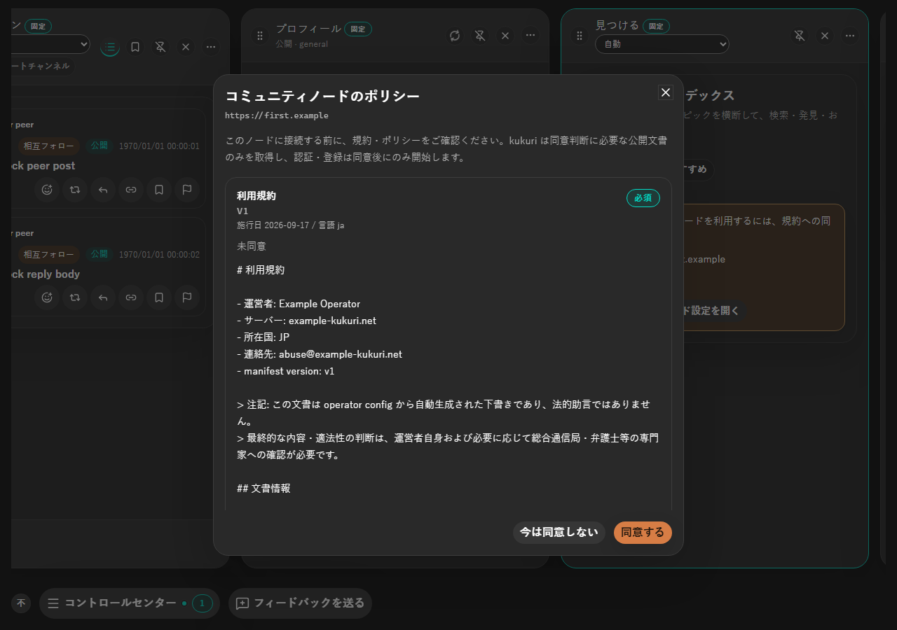
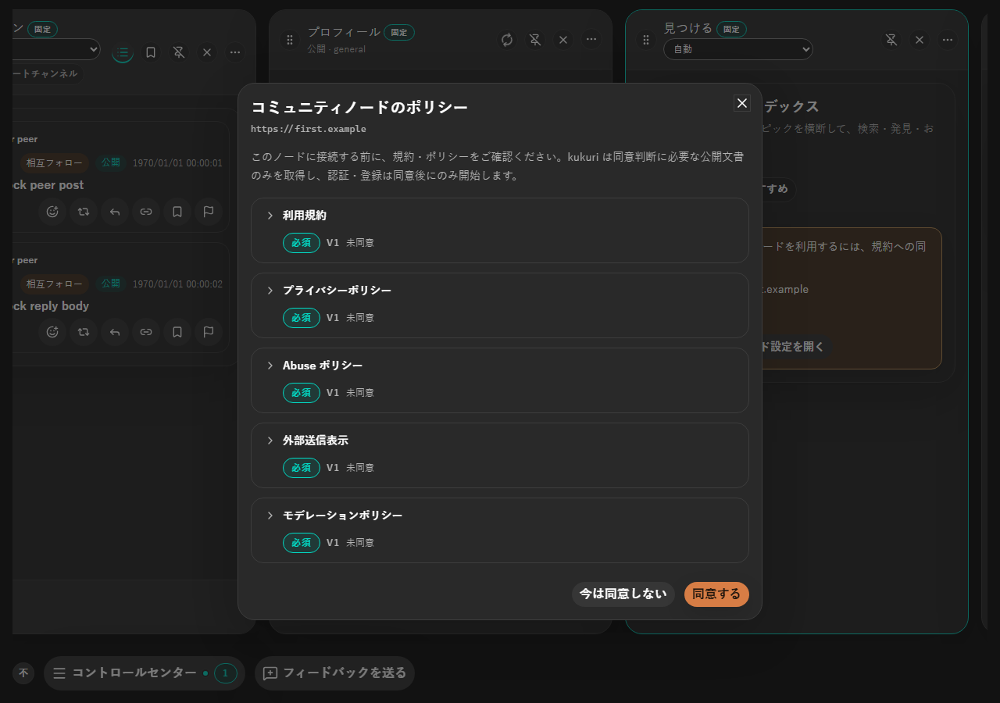
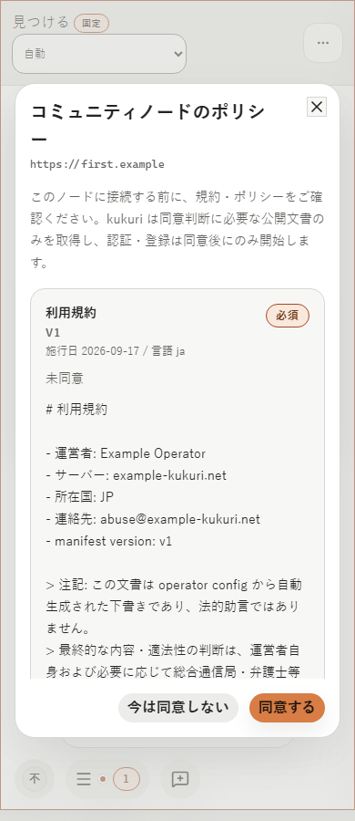
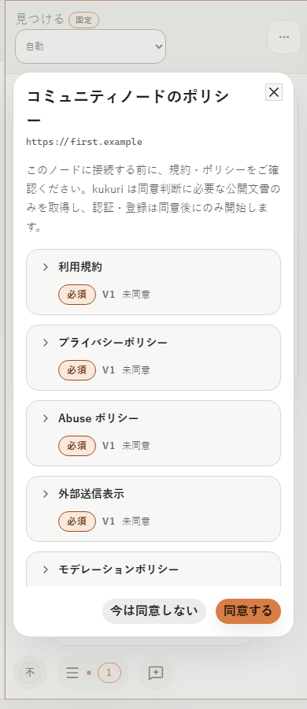
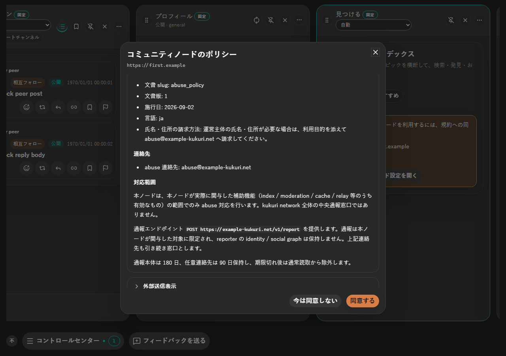
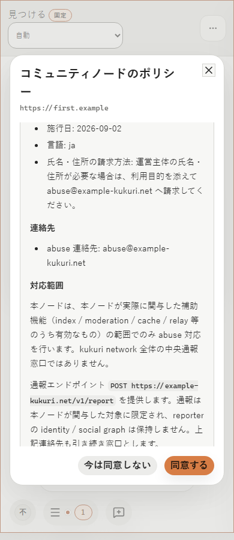
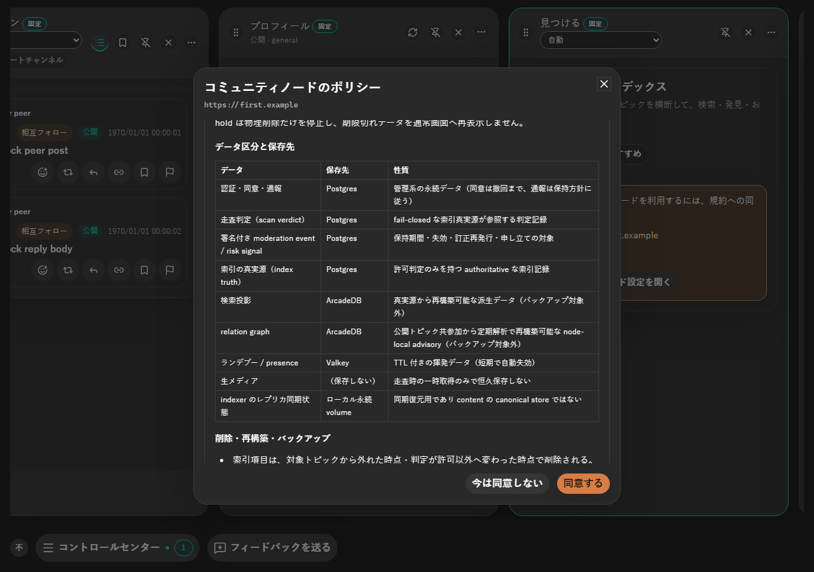
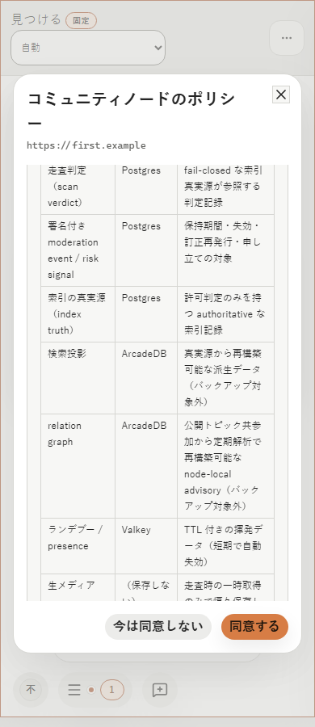

# 2026-09-17 コミュニティノード規約の Markdown 表示と折りたたみ

- Status: current
- Supersedes: None
- Superseded by: None
- PR: [#1115](https://github.com/kukuri-app/kukuri/pull/1115)
- Issue / Scope revision: [#1106](https://github.com/kukuri-app/kukuri/issues/1106)、2026-09-17
- Preview: 下表の before / after 画像（`assets/1106/`）
- 対象 surface / 利用者 / 目的: コミュニティノードの規約 Dialog（設定・見つける・初回案内・Dome hosting から開く共通 Dialog）。ノードへ初めて同意する人と、規約更新で再同意する人が対象。各文書を読みやすい形で確認でき、文書が多くても Dialog が長くなりすぎないようにする。
- 変更分類: 既存画面の改善（ADR 0014 §2）。本文の表示方法、文書ごとの折りたたみ、更新文言の変更。

## 採用した表示

文書は折りたたんだ一覧で表示する。各行は開閉ボタンを兼ねた文書名と、その下の必須/任意・更新・版・同意状況で構成する。版が上がった更新では「v1 から v2 に更新されました。」、版が同じまま内容だけ変わった場合は「内容が更新されました。」を同じ行に出す。

文書名を押すと本文が開く。本文はノードから受け取った Markdown として、見出し・箇条書き・引用・表・コード・リンクを描画する。本文の見出しは Dialog の見出し階層の下に置く。raw HTML は要素にせず文字列のまま表示する。リンクは絶対 HTTP(S) だけを OS のブラウザで開き、その他の scheme は文字として表示する。施行日・言語・参考訳の注記は本文の前に置く。

外部依存は追加していない。parser は React 要素に対応する構造だけを返し、HTML 文字列を DOM に挿入しない。

開閉は表示だけの状態で、Dialog を閉じると初期状態に戻る。同意ボタンの有効条件と、送信する文書・版・snapshot は変えていない。

## 条件と証跡

- Platform: Chromium（Playwright、mock runtime）。Windows WebView2 実機は未確認（下記）。
- Viewport: 1280×900 と 390×900（撮影）。自動テストは 1280×800 と 390×800。
- Theme: dark と light。
- Locale: ja（撮影）。自動テストは ja / en / zh-CN。
- State: 未同意の 7 文書（cn-operator のサンプル config から生成した実文書）、展開（見出し・箇条書き・引用・インラインコード）、表を含む文書の展開。同版更新・版更新・取得失敗・空・撤回済みは Storybook（`Settings/CommunityNodeConsentDialog`）と Vitest で確認。

| 条件 | 変更前 | 変更後 |
| --- | --- | --- |
| ja / dark / 1280px |  |  |
| ja / light / 390px |  |  |
| 展開（dark / 1280px） | 変更前は全文書が常時展開 |  |
| 展開（light / 390px） | 同上 |  |
| 表を含む文書 | 同上 |   |

変更前は Markdown の記号がそのまま表示され、7 文書の全文が縦に並んでいた。変更後は 7 文書の必須/未同意が 1 画面で分かり、読む文書だけを開ける。

## Accessibility・性能・未確認事項

開閉ボタンは見出し要素の中に置き、`aria-expanded` と、開いているときだけ `aria-controls` を持つ。本文は開閉ボタン名をラベルにした region とした。必須/任意・版・同意状況・更新内容は accessible description に結んだ。Tab で文書名へ移動し、Enter と Space で開閉できること、開閉だけでは同意も取得の追加も起きないことを Playwright で確認した。表とコードブロックは横スクロールに対応し、keyboard で focus できる。390px で Dialog に横方向のはみ出しが無いことを同じ spec で確認した。reduced motion では開閉アイコンの向きだけを切り替え、回転のアニメーションは行わない。

本文は開いている文書だけ描画し、parse 結果は本文ごとに memo 化する。追加の取得や polling は無い。

未確認: Windows WebView2 と Ubuntu WebKitGTK の実機描画、screen reader の実際の読み上げ、200% zoom での本文表示、Windows High Contrast、物理タッチ入力、zh-CN / en の撮影。視覚回帰 baseline（Linux/Chromium）は「Kukuri Visual Baseline」workflow で更新する。

## Review result

- 一貫性: 設定・見つける・初回案内・Dome hosting が同じ Dialog を使い、どの導線でも同じ一覧と本文表示になる。
- エラー防止: 折りたたんでも全文書が一覧に残り、必須と未同意の状態が常に見える。同意対象は表示状態に依存しない。
- 記憶負荷: 更新の種類（版の更新か内容だけの更新か）を文言で区別した。
- 安全性: ノード由来の本文から HTML 要素・script・非 HTTP(S) リンクを作らない。

## Exceptions

None。必要な確認の未実施は「未確認事項」に記載した。
