# 2026-09-17 推定による代替表示の詳細 dialog 化

- Status: current
- Supersedes: [2026-09-16 「見つける」の content advisory 代替表示](2026-09-16-1055-discover-content-advisory.md)
- Superseded by: None
- PR: 本 record を含む #1108 の PR（`Closes #1108`）
- Issue / Scope revision: [#1108](https://github.com/kukuri-app/kukuri/issues/1108)、2026-09-17
- Preview: 下表の before / after 画像（`assets/1108/`）
- 対象 surface / 利用者 / 目的: タイムライン・スレッド・ブックマーク・プロフィールと「見つける」の閲覧者のうち、成人向け表現の表示設定が OFF の人。コミュニティノードの推定が付いた投稿の代替表示が一覧を圧迫しないようにし、推定の詳細は必要な人だけが開いて読めるようにする。
- 変更分類: 既存画面の改善（ADR 0014 §2）。共有 component（`PostMedia` / `PostGatedContent`）への state 追加と、詳細 dialog の追加。
- 関連: [#1056 の record](2026-09-16-1056-timeline-advisory-and-node-adoption.md) のうち、説明ブロックをカード内に置く判断だけを本 record が置き換える。照会中のスケルトンとノードごとの採用設定は #1056 の record が引き続き有効。

## 採用した表示

一覧では説明を常時展開しない。

- メディア枠を持つ投稿は、枠全体を 1 つの button にする。枠の中央に「成人向け画像: 詳細はクリック」（動画は「成人向け動画: 詳細はクリック」）だけを重ね、本文欄には何も出さない。画像・動画は従来どおり取得も描画もしない。
- メディア枠を持たない投稿（本文だけの投稿、返信プレビュー親への推定、「見つける」の未解決結果）は、本文欄に「成人向けの投稿: 詳細はクリック」という短い button だけを置く。未解決の結果は、従来の「解決中」の文言をその上に残す。
- 枠または button を押すと詳細 dialog を開く。見出しは「コミュニティノードによる推定」、説明に従来の代替表示の文言（投稿者の申告かノードの推定か）を置き、本体に推定の出所の説明・発行ノード・分類・確信度・根拠、footer に「異議を申し立てる」を置く。通報操作が出せない文脈では申し立てを出さない。
- 「異議を申し立てる」を押すと詳細 dialog を閉じ、既存の通報 dialog を申し立てモードで開く。

投稿者の自己申告だけの投稿（推定なし）と、別の投稿でゲートされた共有メディアの代替表示は変えていない。自己申告と推定が両方ある投稿は、一覧を同じ短いラベルにし、dialog の説明を自己申告の文言にする。

短いラベルの「成人向け」は分類名として使う。ADR 0046 §6.3 が避ける断定（「成人向けと認定」）にしないため、推定であることと出所の説明は dialog の中で必ず示す（[ADR 0046 §6.3](../adr/0046-age-attestation-adult-content-gating.md)）。

## 条件と証跡

- Platform: Chromium（Playwright、deterministic mock）。Windows WebView2 実機は未確認（下記）。
- Viewport: 1400×980 と 390×844。
- Theme: dark と light。
- Locale: ja、en、zh-CN。
- State: 推定付き画像（一覧 / dialog）、推定付き動画、本文だけの推定、未解決結果、申し立て不可の文脈、自己申告と推定の併存、自己申告のみ、表示設定 ON。

| 条件 | 変更前 | 変更後（一覧） | 変更後（dialog） |
| --- | --- | --- | --- |
| タイムライン / ja / dark / 1400px | 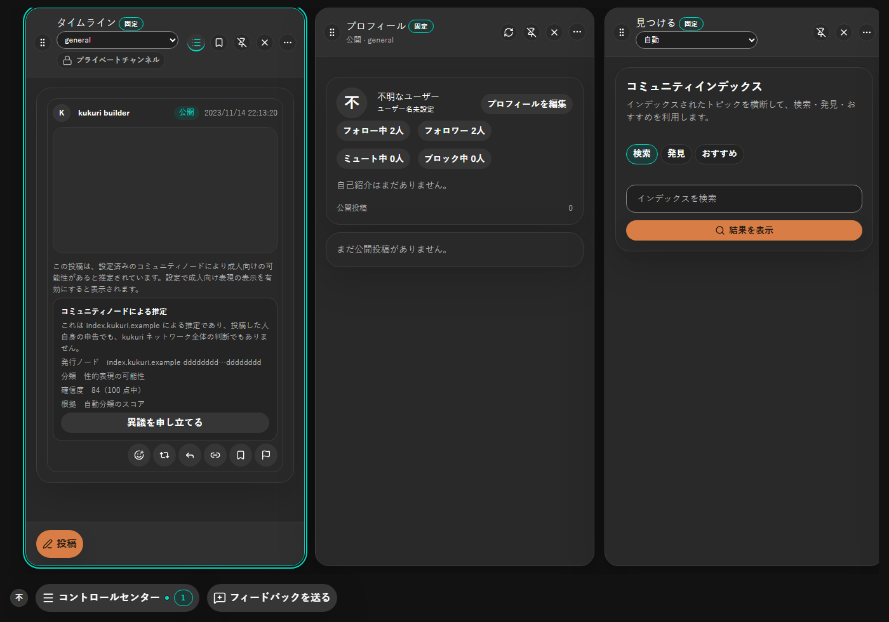 | 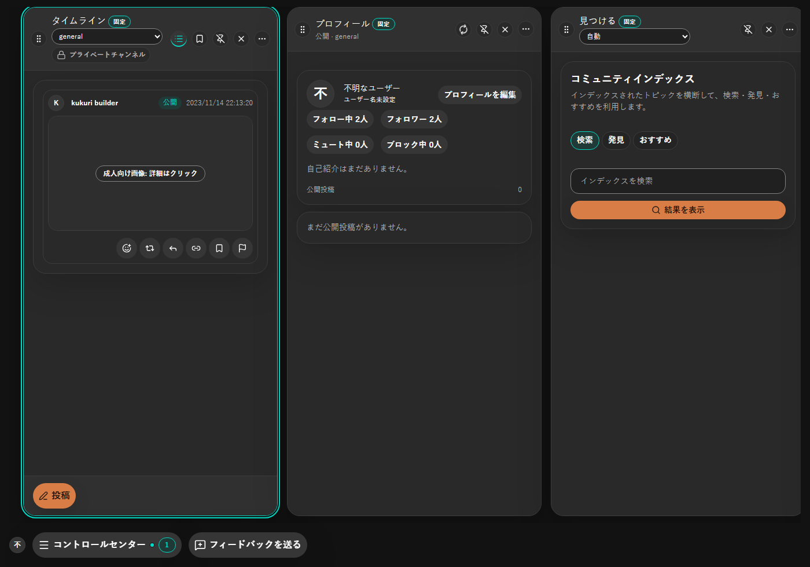 | 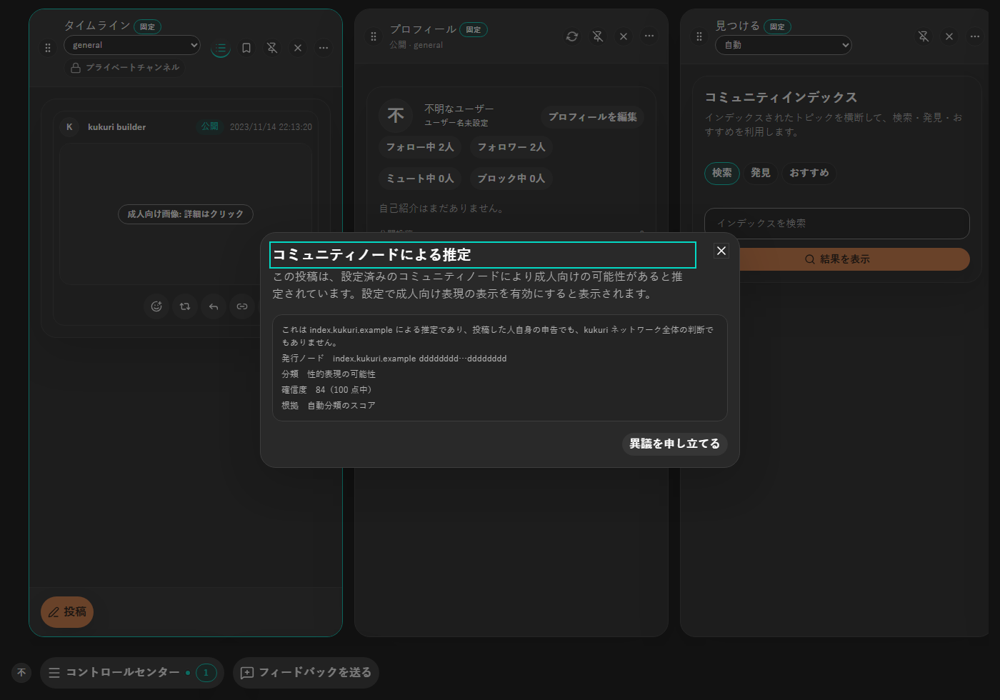 |
| タイムライン / ja / light / 390px |  | 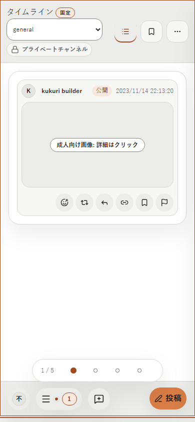 | 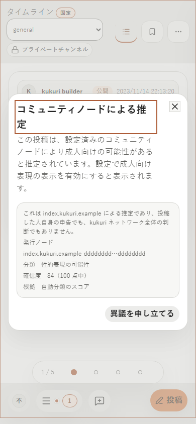 |
| タイムライン / en / light / 1400px | 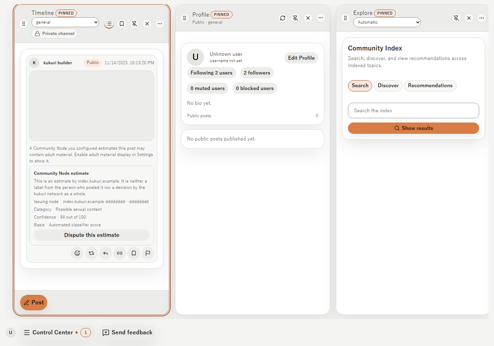 | 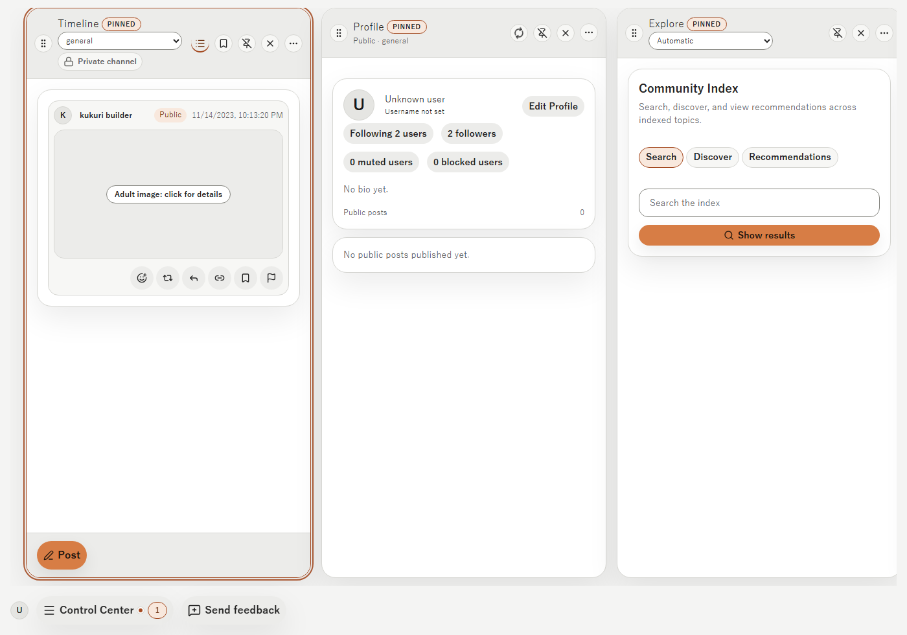 | 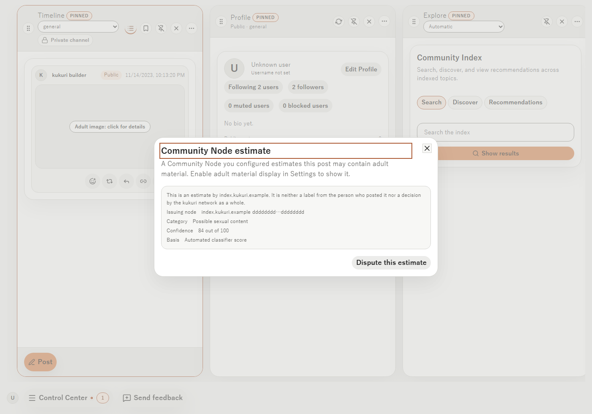 |
| タイムライン / zh-CN / dark / 390px | 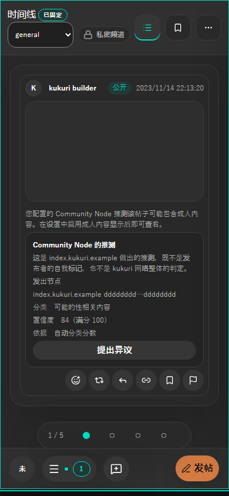 | 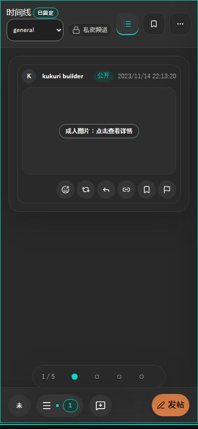 | 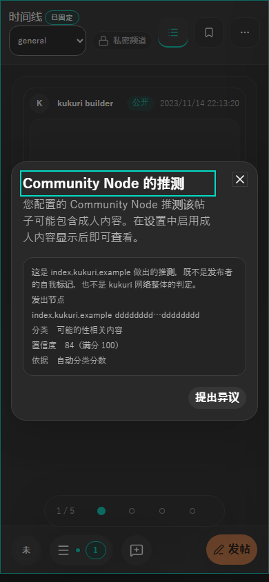 |
| 見つける / ja / dark / 1400px | 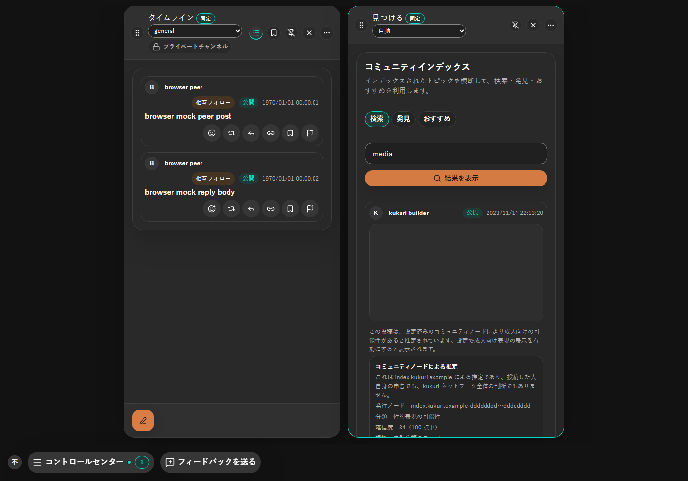 | 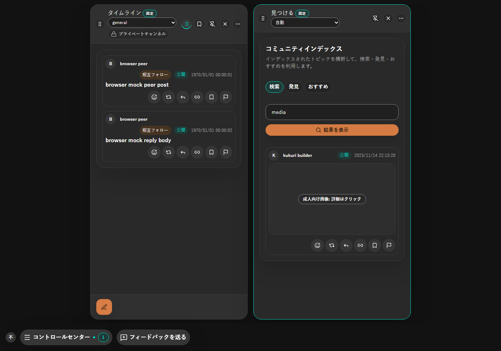 | 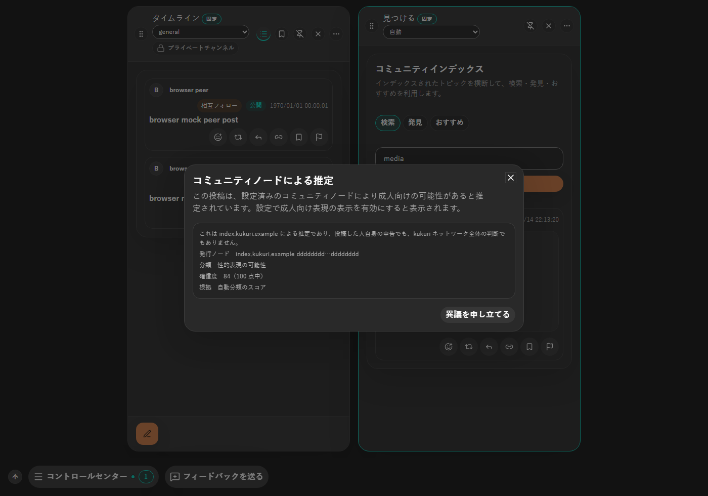 |

変更前は 1 件の投稿が画像枠・説明文・推定の詳細・申し立てボタンで縦に長くなっていた。変更後は通常の画像投稿と同じ高さに収まる。

視覚回帰 baseline（Linux / Chromium）に、タイムラインの代替表示と詳細 dialog を ja / dark / 1400px と en / light / 390px で追加した（`advisory-placeholder-*` / `advisory-details-*`）。

## Accessibility・性能・未確認事項

- 枠と本文欄の操作はどちらもネイティブの button で、`aria-haspopup="dialog"` を持つ。accessible name は表示ラベルそのもの。Enter / Space で開くことを Vitest と Chromium で確認した。
- 開いた直後の focus は dialog の見出しに置く。最初の操作（異議申し立て）に置くと、開いた直後の Enter で意図せず申し立てへ進むため。既存の同意 dialog と同じ扱い。
- dialog を閉じると、開いた枠または button へ focus が戻る。申し立てへ移った場合は、通報 dialog を閉じた後に同じ要素へ戻る。
- 390px で document の横スクロールが発生しないことを、一覧と dialog の両方で確認した。ラベルは枠幅に合わせて折り返せる。
- 本文欄の button は高さ 44px を確保する。
- dialog を開いてもメディア要素を描画せず、blob bytes の要求が 0 のままであることを shell 結合 test で確認した（タイムライン・見つける）。取得ゲートと追加の通信は変えていない。
- 大規模一覧の性能計測は行っていない。一覧の DOM は減り、dialog は開いたカードだけが描画する。

未確認: Windows WebView2 と Ubuntu WebKitGTK の実機描画、物理タッチ・ペン入力、screen reader の読み上げ、Windows High Contrast、200% zoom。

## Validation

- Vitest: `PostCard.advisory.test.tsx`（新規）、`CommunityIndexWorkspace.advisory.test.tsx`、`DesktopShellPage.timelineAdvisory.test.tsx`、`DesktopShellPage.communityIndexMedia.test.tsx`
- Playwright: `advisory-details.spec.ts`（新規）、`timeline-advisory.spec.ts`、`community-index-advisory.spec.ts`、`visual.spec.ts`
- Storybook: `Core/PostCard` の `AdvisoryGated` / `AdvisoryGatedVideo` / `AdvisoryGatedTextOnly` / `AdvisoryDetailsOpen`
- 実行結果は PR 本文に記録する。

## Review result

- 情報量: 一覧は 1 行のラベルだけになり、推定の詳細は必要な人だけが開く。
- 一貫性: 画像・動画・本文だけの投稿で同じ dialog を使い、タイムラインと「見つける」で同じ component を使う。
- エラー防止: 推定であることの説明を dialog から外さない。開いた直後の Enter で申し立てへ進まない。
- 主導権: 申し立ての導線は dialog の中に残り、送信先は従来どおり発行ノードだけに限られる。

## Exceptions

None。必要な確認の未実施は「未確認事項」に記載した。
